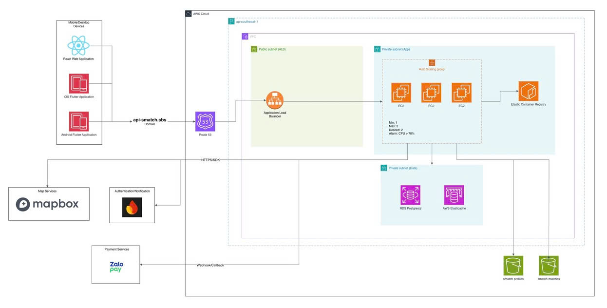

# Smatch-Go

Smatch-Go is the backend service for a badminton court booking and match-making platform. It supports court discovery, nearby search, booking management, match creation and joining, payment processing, and authenticated user workflows for a connected sports community.

## Overview

Smatch-Go provides the server-side API for a system that helps players find badminton courts, book time slots, create or join matches, and complete payments in a single flow. It exposes a JSON REST API, WebSocket endpoints for real-time updates, and a map tile proxy for court visualization.

Main capabilities:

- Court listing, detail retrieval, creation, update, and deletion
- Nearby court search using PostgreSQL/PostGIS geospatial queries
- Booking creation, lookup, and cancellation
- Match creation, update, cancellation, join, leave, and join-request management
- Payment creation, callback handling, status lookup, and cancellation
- Firebase-based authentication and user profile management
- WebSocket-based real-time updates for payments and matches
- Admin-only endpoints for court management and search reindexing
- Redis-backed slot locking, caching, and rate-limited endpoints when Redis is available
- Map tile proxy support for court map visualization

## Tech Stack

- Language: Go 1.23
- HTTP framework: chi router
- Database: PostgreSQL with PostGIS
- Cache and rate limiting: Redis
- Authentication: Firebase Admin SDK
- Payment: ZaloPay
- Real-time communication: Gorilla WebSocket
- Logging: Zap
- Background jobs: robfig/cron
- File storage: AWS S3

## Infrastructure

</img>

### Architecture Diagram

The client layer includes a React web application and Flutter mobile applications for iOS and Android. These clients resolve the API domain through Route 53 and send traffic to an Application Load Balancer.

The backend application runs on EC2 instances inside a private application subnet, managed by an Auto Scaling Group. The instances pull the application image from Amazon ECR and serve the API on port 3000 behind the ALB.

The data layer runs in private subnets and includes:

- Amazon RDS for PostgreSQL as the primary database
- Amazon ElastiCache for Redis for caching and slot locking
- Amazon S3 buckets for profile images and match media

External integrations shown in the diagram include Firebase for authentication and notifications, Mapbox for map services, and ZaloPay for payment callbacks and payment confirmation.

The infrastructure is provisioned with Terraform under [infra/terraform](infra/terraform).

### AWS Services Used

- Route 53 for domain routing to the API
- Application Load Balancer for public traffic entry and health checks
- EC2 Auto Scaling Group for backend application instances
- Amazon ECR for storing the backend Docker image
- Amazon RDS PostgreSQL for persistent relational data
- Amazon ElastiCache Redis for cache and lock storage
- Amazon S3 for file assets such as profile and match images
- VPC, public subnets, private application subnets, and private data subnets for network isolation
- ACM and Route 53 DNS validation when domain-based HTTPS is enabled


## Setup Guide

### 1. Install prerequisites

Before setting up the project, make sure you have:

- Go 1.23 or later
- Docker and Docker Compose if you want to run the backend in a container
- Terraform 1.6 or later
- AWS CLI configured with the correct profile
- A PostgreSQL database with PostGIS support
- Redis if you want cache, lock, and rate-limiting support
- Firebase service account credentials
- ZaloPay merchant credentials

### 2. Install project dependencies

```bash
go mod download
```

### 3. Configure local application settings

Create a `.env` file in the project root and fill in the values required by `internal/config/config.go`.

Important variables include:

- `DATABASE_URL`
- `FIREBASE_CREDENTIALS_FILE`
- `ZALOPAY_APP_ID`
- `ZALOPAY_KEY1`
- `ZALOPAY_KEY2`
- `ZALOPAY_CALLBACK_URL`
- `REDIS_HOST`
- `REDIS_PORT`
- `REDIS_PASSWORD`
- `REDIS_TLS_ENABLED`
- `AWS_REGION`
- `AWS_ACCESS_KEY_ID`
- `AWS_SECRET_ACCESS_KEY`
- `AWS_ENDPOINT`
- `AWS_S3_BUCKET_PROFILE`
- `AWS_S3_BUCKET_MATCHES`
- `TILE_SERVER_URL`
- `TILE_LAYER_ID`
- `ADMIN_SECRET`

### 4. Prepare the database

Apply the SQL migrations in [migrations](migrations) to your PostgreSQL instance before starting the application.

### 5. Run the backend locally

```bash
go run ./cmd/server
```

The server listens on the port defined by `PORT` and exposes `/health`, `/version`, the REST API, and WebSocket endpoints.

### 6. Build and push the Docker image to AWS ECR

Before deploying to AWS, you need to build the backend Docker image and push it to Amazon ECR. This image will be pulled by EC2 instances in the Auto Scaling Group.

First, create an ECR repository (if not already created):

```bash
aws ecr create-repository \
	--repository-name smatch-backend \
	--region ap-southeast-1
```

Then, build the Docker image:

```bash
docker build -t smatch-go .
```

Log in to Amazon ECR:

```bash
aws ecr get-login-password --region ap-southeast-1 | docker login --username AWS --password-stdin YOUR_AWS_ACCOUNT_ID.dkr.ecr.ap-southeast-1.amazonaws.com
```

Tag the image with the ECR repository URL:

```bash
docker tag smatch-go:latest YOUR_AWS_ACCOUNT_ID.dkr.ecr.ap-southeast-1.amazonaws.com/smatch-backend:latest
```

Push the image to ECR:

```bash
docker push YOUR_AWS_ACCOUNT_ID.dkr.ecr.ap-southeast-1.amazonaws.com/smatch-backend:latest
```

Save the full ECR image URL for use with Terraform:

```bash
YOUR_AWS_ACCOUNT_ID.dkr.ecr.ap-southeast-1.amazonaws.com/smatch-backend:latest
```

### 7. Run the infrastructure with Terraform

The Terraform configuration lives in [infra/terraform](infra/terraform).

The infrastructure provisions the AWS stack shown in the diagram:

- Route 53 for DNS
- Application Load Balancer in a public subnet
- EC2 Auto Scaling Group for the backend application
- Amazon ECR for the backend image
- Amazon RDS PostgreSQL in a private data subnet
- Amazon ElastiCache Redis in a private data subnet
- Amazon S3 buckets for profile and match media
- VPC, public subnets, private application subnets, and private data subnets

After pushing the Docker image to ECR, proceed with Terraform. Note that the `ecr_repo_url` variable must point to your pushed image URL.

Typical Terraform workflow:

```bash
cd infra/terraform
terraform init
terraform plan \
	-var="db_password=YOUR_DB_PASSWORD" \
	-var="ami_id=YOUR_AMI_ID" \
	-var="ecr_repo_url=YOUR_AWS_ACCOUNT_ID.dkr.ecr.ap-southeast-1.amazonaws.com/smatch-backend:latest" \
	-var="zalopay_app_id=YOUR_ZALOPAY_APP_ID" \
	-var="zalopay_key1=YOUR_ZALOPAY_KEY1" \
	-var="zalopay_key2=YOUR_ZALOPAY_KEY2"
terraform apply \
	-var="db_password=YOUR_DB_PASSWORD" \
	-var="ami_id=YOUR_AMI_ID" \
	-var="ecr_repo_url=YOUR_AWS_ACCOUNT_ID.dkr.ecr.ap-southeast-1.amazonaws.com/smatch-backend:latest" \
	-var="zalopay_app_id=YOUR_ZALOPAY_APP_ID" \
	-var="zalopay_key1=YOUR_ZALOPAY_KEY1" \
	-var="zalopay_key2=YOUR_ZALOPAY_KEY2"
```

If you use a real domain, also set `domain_name` and `create_dns=true` so Terraform can create the DNS records and ACM certificate.

### 8. Monitor and manage the deployment

Once Terraform completes successfully, the infrastructure is live. You can view the outputs (API URL, RDS endpoint, etc.) by running:

```bash
cd infra/terraform
terraform output
```

### Optional: Run Locally with Docker

If you want to test the backend application in a container without deploying to AWS:

Build the Docker image:

```bash
docker build -t smatch-go .
```

Run the container with your `.env` file:

```bash
docker run --rm -p 3000:3000 --env-file .env smatch-go
```

The container image copies the compiled server binary and the migration files into the runtime image.
